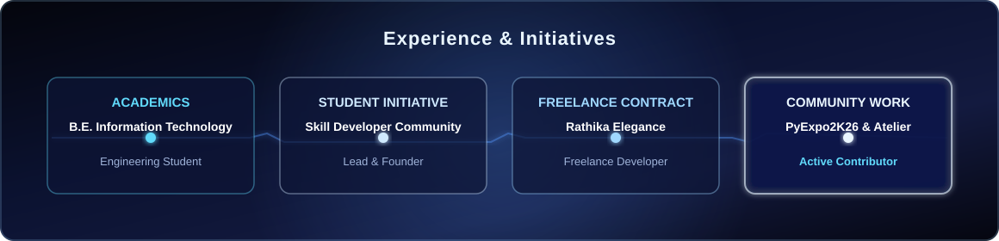
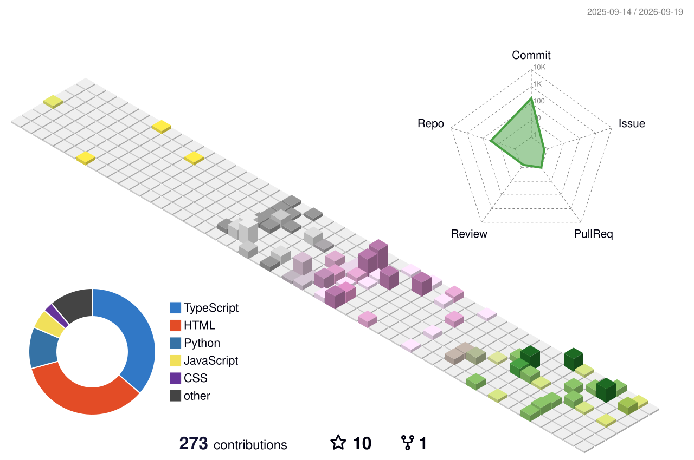

<h1>Hi, I'm Mohan Prasad 👋</h1>
<h3>Information Technology Engineering Student</h3>

 

 

## 🖥️ whoami

  

 

## 🛠️ Tech Stack

  

 

## 💼 Experience & Initiatives

  

 

<b>🟡 Lead & Founder — Skill Developer Community</b> &nbsp;Student Initiative

 

The official collaborative space for our class students to build projects, learn industry-standard version control workflows, review peer code, and systematically level up technical skills together.

`Git` `GitHub` `Open Source` `Team Collaboration` `Project Architecture`

<b>🔵 Freelance Developer — Rathika Elegance</b> &nbsp;Freelance Contract

 

Designed and deployed a premium client solution focused on digital workflows, custom layout structural presentation, and highly responsive user interfaces.

`TypeScript` `Modern CSS` `Vite` `Frontend Design`

<b>🔵 Active Community Contributor — PyExpo2K26 & AtelierTechWorks</b>

 

Actively collaborating within student community spaces to bridge the gap between academic learning and industry standards through open-source contributions.

`Python` `Community Building` `Version Control`

**🎓 B.E. Information Technology Engineering**  
**💡 Philosophy:** *"I believe mistakes are stepping stones to success, and I'm excited to share my journey with you!"*

 

## 🎨 Featured Projects

| | | |
|---|---|---|
| 🎵 **[Melos Music Player](https://github.com/mohan-prasad-d/Melos-Music-Player)** | Modern Music Streaming App with advanced playback, playlist management, smart search, and YouTube Integration. | `React 18` `TypeScript` `Tailwind CSS` `Vite` |
| 🤖 **[Plant Disease Detector](https://github.com/mohan-prasad-d/Plant-disease-detector--AI)** | Intelligent computer-vision system capable of diagnosing crop and plant health risks automatically. | `Python` `Machine Learning` `Computer Vision` |
| 🌟 **[Rathika Elegance](https://github.com/mohan-prasad-d/Rathika_Elegance_)** | Premium client freelance landing ecosystem designed to streamline digital workflows and responsive presentation. | `TypeScript` `Modern CSS Frameworks` `Vite` |
| 💼 **[CRM App](https://github.com/mohan-prasad-d/Crm-app)** | Efficient Customer Relationship Management System to track business workflows and pipeline analytics. | `React` `JavaScript` `MySQL` `Node.js` |
| 📋 **[Attendance System](https://github.com/mohan-prasad-d/Attendence-project)** | Smart Tracking & Analytics dashboard for institutional management featuring real-time automated reports. | `Flask` `Python` `MySQL` `HTML/CSS/JS` |

 

## 📊 GitHub Analytics

 

 

## 🧊 3D Contribution Graph

 

## 🐍 Contribution Snake

<picture>
  <source media="(prefers-color-scheme: dark)" srcset="https://raw.githubusercontent.com/mohan-prasad-d/mohan-prasad-d/output/github-contribution-grid-snake-dark.svg">
  <source media="(prefers-color-scheme: light)" srcset="https://raw.githubusercontent.com/mohan-prasad-d/mohan-prasad-d/output/github-contribution-grid-snake.svg">
  
</picture>

 

📫 **Reach me:** [mohanprasadd2020@gmail.com](mailto:mohanprasadd2020@gmail.com) · [LinkedIn](https://www.linkedin.com/in/mohan-prasad-d-701931377) · [WhatsApp](https://wa.me/919894876599)

 

